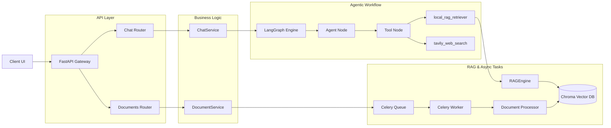

# RAG Multi-Agent Backend


一个面向生产环境的高性能 AI 后端服务及现代化前端界面，基于 **FastAPI + LangGraph + Celery + PostgreSQL + Redis + Chroma + React 18** 构建。本项目支持文档异步入库、会话持久化、多工具智能体决策、SSE 流式响应，以及基于 **LangSmith 的全链路可观测性**。

---

## 📖 目录

- [项目定位](#-项目定位)
- [核心特性](#-核心特性)
- [版本演进](#-版本演进)
- [系统架构](#-系统架构)
- [目录结构](#-目录结构)
- [快速开始 (Docker Compose)](#-快速开始-docker-compose)
- [环境配置 (.env)](#-环境配置-env)
- [常见问题与排障 (FAQ)](#-常见问题与排障-faq)
- [API 参考](#-api-参考)
- [贡献指南与协议](#-贡献指南与协议)

---

## 🎯 项目定位

本项目专注于将 AI 概念原型升级为工业级后端服务，并配套现代化的极致用户体验：
- **现代化体验**：前端基于类微信、沉浸式对话流设计，提供带呼吸感的阅读体验与精细化 Markdown 渲染。
- **安全与便捷**：精简了前端繁琐的 Token 校验层，提供即开即用的顺畅体验。
- **高可用与健壮性**：启动时对依赖环境与外部服务进行连通性自检。
- **可扩展架构**：使用 PostgreSQL 替代内存/SQLite，Celery 剥离长耗时 I/O 与 CPU 密集型任务。

---

## ✨ 核心特性

- 🎨 **极致打磨的前端 UI (v2.2.0)**：
  - **沉浸式对话布局**：两边聊天气泡在页面中央单列排布，最大宽度限制在 `800px` 左右，避免宽屏视觉疲劳。
  - **智能气泡自适应**：用户气泡呈现“胶囊+尾巴”样式、浅灰底色，宽度随字数自适应，超过 2/3 自动换行，并与 AI 回答框右侧精准对齐。
  - **沉浸式 AI 回答**：取消 AI 气泡的明显背景色，与页面底色融为一体，仅通过大写字母头像“A”区分。
  - **呼吸感排版**：AI 长文本输出行高设定在 `1.6 - 1.7` 之间，段落间距明显；正文使用常规体（Regular/400），Markdown 加粗及标题具有明显的字重对比（Semibold/600）。
- 🧠 **LangGraph 智能体决策**：构建 `agent -> tools -> agent` 的闭环工作流，实现意图识别与工具分发。
- 🛠️ **多源路由工具**：`local_rag_retriever` (Chroma 知识库) 与 `tavily_web_search` (联网搜索)。
- ⚡ **统一的流式响应 (SSE)**：流式与普通输出结构一致，全部经过 LangGraph 决策链。
- ⏱️ **异步文档解析管线**：支持大型 PDF 文件的上传，通过 Celery 异步调度 PyMuPDF + Tesseract OCR 完成提取。

---


## 🚀 版本演进

### v2.2.0 (前端 UI 体验升级)
- **UI/UX 重构**：全面优化了对话区域的排版、气泡样式、对齐方式以及文本的“呼吸感”。
- **交互优化**：移除了每次进入界面时必须输入 API Token 的弹窗机制，实现即开即用的顺畅体验。
- **细节打磨**：调整了左上角“智能体助手”的标题字号，优化了 Markdown 的字重渲染规则。

### v2.1.0 (后端生产级重构)
- **架构升级**：引入 PostgreSQL 持久化 `ChatHistory` 与 `Document`。
- **异步任务**：集成 Celery + Redis 处理 PDF 提取与 OCR 任务。
- **可观测性**：接入 LangSmith 追踪全链路运行日志与检索召回率。

---

## 🏗️ 系统架构



---

## 📂 目录结构

```text
llm-rag-knowledge-base/
├── frontend/               # React 18 前端工程 (Vite)
├── api/                    # 接口路由层 (Routers)
├── core/                   # 核心配置与基建层 (Celery, Config)
├── db/                     # 数据持久层 (SQLAlchemy, PostgreSQL)
├── schemas/                # Pydantic 校验模型
├── services/               # 核心业务层 (LangGraph, 任务调度)
├── tasks/                  # Celery 异步任务定义
├── utils/                  # PDF处理与RAG检索引擎
├── docker-compose.yml      # 全链路服务容器编排
└── main.py                 # FastAPI 应用总入口
```

---

## 🚀 快速开始 (Docker Compose)

### 1. 准备配置文件
复制模板并填入您的真实密钥：
```bash
cp .env.example .env
```

### 2. 一键启动后端服务
**重要**：务必同时启动 `api` 与 `worker` 容器。
```bash
docker compose up -d --build
```
该命令会自动拉起 API、Celery Worker、Redis、PostgreSQL。

### 3. 启动前端服务
```bash
cd frontend
npm install
npm run dev
```
访问 `http://localhost:5173` 即可体验。

---

## 🔧 常见问题与排障 (FAQ)
### 问题 1：Docker 拉取基础镜像失败？
- **排查步骤**：受限于网络，请在 Docker Desktop 中配置国内镜像加速（`registry-mirrors`），或在 `.env` 中修改 `DOCKER_PYTHON_IMAGE` 变量使用第三方镜像站源。

### 问题 2：服务构建成功，但无法访问 `http://127.0.0.1:8000/docs`？
- **排查步骤**：执行 `docker compose logs api --tail 50`。通常是因为 `.env` 缺少强制要求配置的环境变量（如 `OPENAI_API_KEY`）导致启动失败。

### 问题 3：上传了很小的文档 ，但解析时间超过 2 分钟一直卡在处理中？
- **原因**：前端一直在轮询任务状态，但是 Celery **Worker 容器未启动**，导致任务一直在 Redis 队列里无人消费。
- **解决方案**：检查服务状态 `docker compose ps`，如果没有看到 `rag-worker`，请执行 `docker compose up -d api worker` 将其拉起。你可以通过 `docker compose logs -f worker` 观察任务是否被消费。

---

## 🔌 API 参考

所有业务接口均需携带 `Bearer Token`（此功能目前已对前端 UI 屏蔽，可实现无感调用，但 API 层面仍生效）。

| 模块 | 方法 | 路径 | 描述 |
| --- | --- | --- | --- |
| **基础** | `GET` | `/api/v1/health` | 检查应用连通性与状态 |
| **对话** | `POST` | `/api/v1/chat/stream`| 发起 SSE 流式对话请求 |
| **文档** | `POST` | `/api/v1/documents/upload` | 上传文档并创建异步解析任务 |
| **任务** | `GET` | `/api/v1/tasks/{task_id}` | 获取文档解析任务进度 |

---

## 📜 贡献指南与协议

本项目遵循 [MIT License](./LICENSE) 开源协议。欢迎 Fork 仓库并提交 Pull Request！
