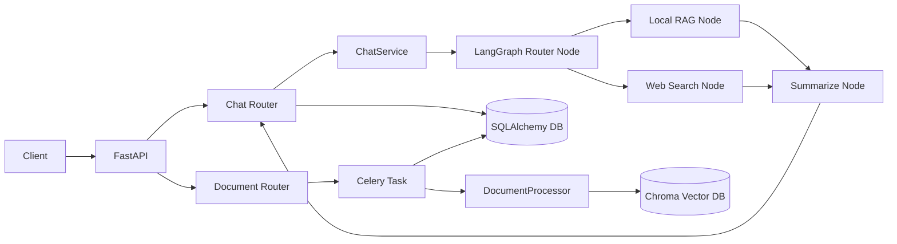

# RAG Multi-Agent Backend


基于 **FastAPI + LangGraph + Celery + Chroma** 的 RAG 多智能体后端服务，面向 PDF 知识库问答场景，提供会话持久化、异步文档处理、流式输出与可观测性集成能力。

## 目录

- [项目简介](#项目简介)
- [核心特性](#核心特性)
- [技术栈](#技术栈)
- [系统架构](#系统架构)
- [快速开始](#快速开始)
- [配置说明](#配置说明)
- [API 概览](#api-概览)
- [项目结构](#项目结构)
- [更新记录](#更新记录)
- [License](#license)

## 项目简介

该项目已从 Streamlit 原型逐步演进为后端服务形态：

- 使用 **FastAPI + Uvicorn** 暴露标准 RESTful API
- 使用 **SQLAlchemy** 持久化 `User`、`Document`、`ChatHistory`
- 使用 **LangGraph** 构建 `Router -> Local RAG / Web Search -> Summarize` 工作流
- 使用 **Celery + Redis** 异步处理 PDF 解析、OCR 与向量化

## 核心特性

- **会话持久化**：对话消息写入数据库，支持按 `session_id` 查询历史。
- **流式与非流式双通道**：同时支持 JSON 响应与 SSE 流式 token 输出。
- **多智能体分发**：根据问题意图自动路由至本地知识库检索或 Web Search。
- **异步文档处理**：上传文档后进入后台任务，前端可轮询任务进度。
- **可观测性预留**：支持通过环境变量启用 LangSmith tracing。
- **数据库可切换**：默认 SQLite，配置 `DATABASE_URL` 后可切换 PostgreSQL。

## 技术栈

- **Backend**: FastAPI, Uvicorn, Pydantic
- **Database**: SQLAlchemy, SQLite / PostgreSQL (`psycopg2-binary`)
- **Task Queue**: Celery, Redis
- **RAG / Agent**: LangChain, LangGraph, Chroma
- **Document Processing**: PyMuPDF, pytesseract, Pillow
- **Web Search**: Tavily (可选), DuckDuckGo (回退)
- **Observability**: LangSmith (可选)

## 系统架构



## 快速开始

### 1) 环境要求

- **Python 3.10+**
- **Redis**（用于 Celery Broker / Backend）
- **Tesseract OCR**（处理扫描版 PDF）

### 2) 克隆项目

```bash
$ git clone https://github.com/Kyle9901/llm-rag-knowledge-base
$ cd llm-rag-knowledge-base
```

### 3) 创建并激活虚拟环境

```bash
$ python -m venv .venv
```

```bash
# Linux / macOS
$ source .venv/bin/activate
```

```powershell
# Windows PowerShell
> .venv\Scripts\Activate.ps1
```

### 4) 安装依赖

```bash
$ pip install -r requirements.txt
```

### 5) 配置环境变量

在项目根目录创建 `.env`：

```env
# ========== App ==========
APP_NAME=RAG Multi-Agent Backend
APP_VERSION=2.0.0
API_PREFIX=/api/v1

# ========== Model ==========
ZHIPU_API_KEY=YOUR_ZHIPU_API_KEY
OPENAI_API_KEY=YOUR_DEEPSEEK_API_KEY
ZHIPU_BASE_URL=https://open.bigmodel.cn/api/paas/v4
ZHIPU_EMBEDDING_MODEL=embedding-3
DEEPSEEK_BASE_URL=https://api.deepseek.com
DEEPSEEK_MODEL=deepseek-chat

# ========== Storage ==========
DATABASE_URL=sqlite:///./rag_backend.db
CHROMA_PERSIST_DIR=./chroma_db
UPLOAD_DIR=./data/uploads

# ========== Celery ==========
CELERY_BROKER_URL=redis://localhost:6379/0
CELERY_RESULT_BACKEND=redis://localhost:6379/1

# ========== Web Search (Optional) ==========
ENABLE_WEB_SEARCH=false
TAVILY_API_KEY=YOUR_TAVILY_API_KEY

# ========== LangSmith (Optional) ==========
LANGCHAIN_TRACING_V2=false
LANGCHAIN_API_KEY=YOUR_LANGSMITH_API_KEY
LANGCHAIN_PROJECT=rag-multi-agent-backend
```

> Windows 下若 Tesseract 路径不是默认值，请设置 `TESSERACT_CMD`，例如：`C:\Program Files\Tesseract-OCR\tesseract.exe`。

### 6) 启动服务

启动 FastAPI：

```bash
$ uvicorn main:app --reload
```

启动 Celery Worker（另一个终端）：

```bash
$ celery -A celery_app.celery_app worker --loglevel=info
```

访问接口文档：

```text
http://127.0.0.1:8000/docs
```

## 配置说明

关键配置来源于 `config.py`：

- **数据库**：`DATABASE_URL`（默认 SQLite，可改为 PostgreSQL）
- **LLM 与 Embedding**：`OPENAI_API_KEY`, `ZHIPU_API_KEY`
- **异步队列**：`CELERY_BROKER_URL`, `CELERY_RESULT_BACKEND`
- **检索参数**：`RETRIEVER_SEARCH_K`, `TEXT_SPLITTER_CHUNK_SIZE`, `TEXT_SPLITTER_CHUNK_OVERLAP`
- **可观测性**：`LANGCHAIN_TRACING_V2`, `LANGCHAIN_API_KEY`, `LANGCHAIN_PROJECT`

## API 概览

基础前缀：`/api/v1`

### Health

- `GET /api/v1/health`：服务健康检查

### Chat

- `POST /api/v1/chat`：非流式问答  
  请求体：

```json
{
  "session_id": "session-001",
  "query": "这份文档的核心观点是什么？",
  "stream": false,
  "user_id": "user-001"
}
```

- `POST /api/v1/chat/stream`：SSE 流式问答
- `GET /api/v1/chat/history/{session_id}?limit=50`：获取会话历史

### Documents

- `POST /api/v1/documents/upload`：上传文档并创建异步处理任务（`multipart/form-data`）
  - 表单字段：`session_id`, `user_id`(optional), `file`
- `GET /api/v1/tasks/{task_id}`：查询任务状态与进度

## 项目结构

```text
llm-rag-knowledge-base/
├── main.py                    # FastAPI 应用入口
├── config.py                  # 全局配置与环境变量
├── database.py                # SQLAlchemy 引擎与会话依赖
├── models.py                  # ORM 数据模型（User/Document/ChatHistory）
├── schemas.py                 # Pydantic 请求与响应模型
├── celery_app.py              # Celery 应用初始化
├── requirements.txt           # Python 依赖清单
├── frontend_app.py            # 原 Streamlit 前端（保留）
├── routers/
│   ├── __init__.py
│   ├── chat.py                # /chat /chat/stream /chat/history
│   └── documents.py           # 文档上传与任务状态
├── services/
│   ├── __init__.py
│   ├── agent_graph.py         # LangGraph 工作流
│   ├── chat_service.py        # 对话服务（持久化+路由编排）
│   └── document_service.py    # 文档元数据与存储
├── tasks/
│   ├── __init__.py
│   └── document_tasks.py      # Celery 后台任务（OCR/向量化）
└── utils/
    ├── __init__.py
    ├── document_processor.py  # PDF 解析、切块、向量写入
    ├── rag_engine.py          # RAG Chain 与流式问答
    └── chat_manager.py        # Streamlit 聊天管理（前端侧）
```

## 更新记录

- **v2.0.0**
  - 引入 **FastAPI** 后端入口与版本化 API
  - 新增 **SQLAlchemy** 持久化模型与会话历史查询
  - 集成 **LangGraph** 多智能体路由工作流
  - 引入 **Celery + Redis** 异步文档处理链路

## License

本项目采用 **MIT License**。
